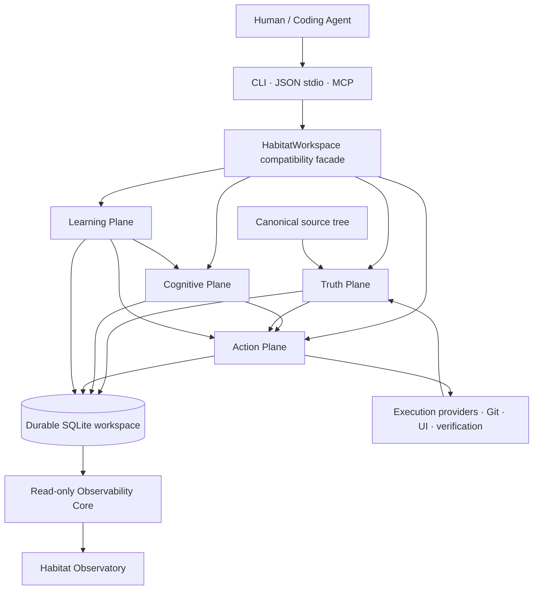

<p align="center">
  <a href="README.md">English</a>
  ·
  <a href="README-VN.md">Tiếng Việt</a>
  ·
  <a href="README-CN.md"><strong>简体中文</strong></a>
</p>

<h1 align="center">Nolane Habitat</h1>

<p align="center">
  <strong>面向编程智能体的持久化项目智能环境。</strong>
</p>

<p align="center">
  把一棵源码树变成一个具备 revision 感知、证据绑定与治理能力的项目世界，让智能体能够观察、推理、修改、验证、checkpoint，并在后续会话中继续工作。
</p>

<p align="center">
  <a href="https://github.com/Nolane-x/Nolane-habitat/releases/tag/v0.1.0-alpha.20">
    
  </a>
  
  <a href="https://github.com/Nolane-x/Nolane-habitat/actions/workflows/ci.yml">
    
  </a>
  <a href="https://github.com/Nolane-x/Nolane-habitat/actions/workflows/codeql.yml">
    
  </a>
</p>

---

## 用一句话理解 Habitat

**Nolane Habitat 是一个本地 project-intelligence substrate：它围绕真实软件项目，为 coding agent 提供持久化、受治理、revision-aware 的工作环境，同时始终保持 canonical source files 作为最终事实来源。**

它不是另一个聊天壳，不是 AI 模型，不是通用向量数据库，也不是 IDE 皮肤。Habitat 位于智能体与真实项目之间：source identity、semantic evidence、task context、project memory、execution receipt、mutation、verification、checkpoint 与 observability 都可以在同一个系统中形成持久状态。

---

## 为什么需要 Habitat

即使 coding model 很强，如果周围的工程环境很弱，它依然会变得不可靠。

多数 coding-agent workflow 都会不断碰到同一批结构性问题：

| 没有持久化项目底座时 | 使用 Nolane Habitat 后 |
| --- | --- |
| 每个 session 都要从文件与搜索重新理解仓库 | 项目拥有 revision-aware 的 durable workspace |
| Context window 同时承担工作记忆与长期记忆 | Context residency 与 Project Memory 被明确分离 |
| Semantic 结果很容易被默认为“事实” | Canonical source 保持 authority，派生 claim 保留自己的 authority/provenance |
| 智能体先直接改代码，出问题后再尝试恢复 | Source change 可以 stage、journal、commit、rollback、recover |
| Verification 只是终端里一次性的输出 | Verification receipt 与 evidence 可以进入持久项目状态 |
| 长任务逐渐退化成彼此松散的聊天回合 | Executive Trajectory 保存 goal、strategy、milestone、budget、failure、recovery 与 closure |
| 已经过期的 assumption 仍继续留在 prompt 中 | Epistemic state 显式建模 fact、assumption、unknown、contradiction、constraint 与 prediction |
| 新智能体只接收到一段自然语言总结 | Checkpoint/resume 与 agent coordination 保存结构化 handoff state |
| “Sandboxed” 常常只意味着“某个进程成功启动了” | Capability claim 必须显式且 fail-honest；无法证明的隔离能力不会被宣传 |
| Observability 是散落在多个终端中的日志 | Observatory 将持久 project/agent activity 投影到专门的 read-only surface |

目标很直接：**让智能体周围的环境比“一堆文件 + 一个 shell”更智能、更可检查，也更难被错误信息欺骗。**

---

## Nolane Habitat 真正不同的地方

### 1. Canonical source 始终是真相

Habitat 把普通项目文件视为可执行 authority。

Semantic index、memory、summary、runtime inference、模型生成的 hypothesis、graph projection 都可以辅助推理，但不能静默地获得高于真实 source 的权力。

这非常重要：如果一个 project-intelligence system 允许“更方便的 representation”意外超越真实代码的 authority，那么系统越智能，风险反而越大。

### 2. 不只是 retrieval，而是持久化 Project World

Habitat 围绕源码树构建面向项目的认知世界：

- semantic relationship 与 source anchor；
- Effect Twin、Dataflow Twin 与 Runtime Twin；
- Project World 与 revision-bound counterfactual world；
- dependency cognition 与 Git cognition；
- task context 与 exact-source paging；
- 持久化 Project Memory；
- epistemic item、hypothesis、experiment、invariant 与 verification evidence。

结果不只是“搜索结果”，而是可以跨 task、跨 agent 持续存在的结构化 project state。

### 3. Evidence 拥有 provenance 与 authority

Foundation Convergence 为派生 claim 引入了显式 trust model。

可以用下面的层级直观理解：

`SOURCE_EXACT > OBSERVED_EXACT > COMPILER_PRECISE > PARSER_DERIVED > HEURISTIC_DERIVED > MODEL_INFERRED`

Memory 不会让 claim 自动升级。一个弱 evidence 被未来 session 再次回忆时，仍然是弱 evidence。

这样可以让上层 cognition 很强，同时不混淆 **直接观测到的内容**、**工具派生的内容** 与 **模型推断的内容**。

### 4. Context 是被编译出来的，不是把整个 repo 塞进窗口

Habitat 不要求把完整 repository 全量丢给智能体。

Context Compiler / Context VM 可以围绕 task 构建 bounded context，按需 page exact source，利用结构关系，并保存 residency/utility 信息。实际收益是减少 context thrash，同时明确区分“智能体当前看到了什么”与“Habitat 长期知道什么”。

### 5. Mutation 是 governed operation

Habitat 的 mutation layer 包含 source authority、transaction state、journaling、conflict detection、rollback、recovery、approval、path lease 与 revision invalidation。

关键变化不是多了几个 API，而是改变了对代码修改的理解：

> Source edit 不只是文本生成，而是对真实项目执行一次受治理的 state transition。

### 6. 长周期任务拥有 Executive Trajectory

对于更长的任务，Habitat 可以保存显式 trajectory：

- goal 与 episode binding；
- strategy generation 与 switching；
- milestone dependency DAG；
- hard budget 与 provider-reported budget；
- verification requirement；
- failure memory；
- recovery 与 continuation；
- 最终 completion gate。

这让 long-running work 拥有持久控制结构，而不是依赖模型在一个越来越长的 prompt 中记住所有早期决策。

### 7. 允许 Learning，但 constitutional rule 不可被学习掉

Learning Plane 可以评估并 promote **soft policy**，例如 retrieval weight、graph depth、context budget、strategy prior、verifier scheduling 或 provider selection。

但它明确不能学习并覆盖以下 hard invariant：

- canonical source authority；
- path escape check；
- revision freshness；
- mutation recovery rule；
- approval requirement；
- containment truthfulness；
- secret-redaction boundary；
- release-governance rule；
- authority ordering。

Adaptation 只有在“无法把系统赖以可信的规则优化掉”时才真正有价值。

### 8. Execution capability 必须 fail-honest

Habitat 把“能执行”与“已隔离”区分开来。

默认 local process 可以被报告为 `trusted-local-process`；更强的 sandbox/filesystem/network/process-isolation claim 只有在当前 execution provider 提供对应 containment evidence 后才会出现。

这是刻意保守的设计。缺少证明时，能力会被标记为 unknown/unsupported，而不是变成营销用语。

### 9. Observatory 是 projection，不是 authority

Habitat Observatory 是建立在 durable state 与 operator activity 上的 loopback、read-only projection。

它可以展示 project activity、world state、execution、UI/operator context、trajectory 与 timeline，但不会成为第二条 mutation path。这样，人类能够观察智能体与环境正在做什么，而展示层本身不会偷偷获得控制权。

### 10. Release engineering 本身就是产品能力

Habitat 把 test、recovery、reproducibility、release identity、evidence provenance 与 promotion gate 当作一等工程 surface。

`v0.1.0-alpha.20` release 不只有 binary artifact，还带有 machine-readable closure evidence、release admission record、checksum 与完整 verification bundle。

---

## 架构

理解 Habitat 最简单的方式，是把它看作围绕一个 durable workspace 协作的四个 plane。



### Truth Plane

负责可以机械检查的 authority：

- source identity、revision、digest、Merkle state；
- source anchor 与 observed receipt；
- evidence provenance 与 staleness；
- hard invariant；
- capability attestation；
- mutation/release authority boundary。

### Cognitive Plane

构建派生 project intelligence：

- Semantic Fabric；
- Project World；
- Context Compiler / Context VM；
- Effect/Dataflow/Runtime Twin；
- Project Memory；
- epistemic state；
- hypothesis 与 experiment；
- counterfactual world；
- executive planning input。

### Action Plane

负责可能改变状态的 operation：

- mutation stage/commit/rollback；
- execution provider；
- browser/UI action；
- verification；
- lease 与 approval；
- multi-agent invalidation；
- checkpoint/resume continuity。

### Learning Plane

在 controlled evaluation 下改进 soft policy：

- outcome ledger；
- ablation/causal experiment；
- policy candidate；
- shadow/canary evaluation；
- promotion gate；
- exact rollback；
- held-out benchmark。

---

## 实际 Agent Loop

一个典型 Habitat workflow：

```text
TASK
  ↓
START / ORIENT
  ↓
COMPILE BOUNDED CONTEXT
  ↓
INSPECT OBJECTS + EXACT SOURCE + REFERENCES
  ↓
FORM / UPDATE EPISTEMIC STATE
  ↓
STAGE GOVERNED CHANGE
  ↓
COMMIT OR ROLLBACK
  ↓
VERIFY AFFECTED SURFACE
  ↓
RECORD EVIDENCE
  ↓
CHECKPOINT
  ↓
RESUME WITH THE NEXT AGENT / SESSION
```

这个 loop 把 coding-agent system 中通常只短暂存在的四件事变成 durable state：

**understanding → action → evidence → handoff**

---

## 核心能力地图

| 能力 | Habitat 提供什么 | 为什么重要 |
| --- | --- | --- |
| Durable workspace | SQLite-backed、revision-aware project state | 项目知识不会随着 prompt/session 结束而消失 |
| Source authority | Canonical project bytes 始终保持 authority | 派生 representation 无法静默替代现实 |
| Semantic Fabric | Provider-aware semantic evidence、source anchor、disagreement handling | 更强导航能力，同时保留 provenance |
| Context system | Orientation、bounded context、exact-source paging、residency | 减少 context-window 浪费与 thrash |
| Project World | Semantic/effect/dataflow/runtime relationship | 让 agent 能在项目结构与行为上推理 |
| Project Memory | Semantic、episodic、procedural、failure、decision、experiment record | 从过去工作中形成持久经验 |
| Epistemic Runtime | Fact、assumption、unknown、contradiction、constraint、prediction | 把 uncertainty 从隐含状态变成可观察状态 |
| Executive Trajectory | Goal、strategy、milestone、budget、recovery、completion gate | 长任务获得 durable control structure |
| Governed mutation | Stage、commit、rollback、journal、recovery、lease、invalidation | 更安全地演化源码 |
| Execution Fabric | Provider capability 与 containment attestation | 阻止没有证据的 sandbox claim |
| Verification | Verification plan、execution receipt、evidence binding | 把“通过了”变成带 provenance 的持久 claim |
| Multi-agent coordination | Agent handle、lease、invalidation、checkpoint/resume | 更结构化的 handoff 与冲突感知 |
| UI / browser cognition | Semantic UI handle、observation、action receipt | 浏览器操作也能进入 evidence-bound project activity |
| Benchmark Lab | Controlled suite、metric、ablation、held-out evaluation | 测量某个 mechanism 是否真的有效 |
| Learning Plane | Immutable policy candidate、evaluation、promotion、rollback | 在不改写 invariant 的前提下持续改进 |
| Observatory | Read-only project/agent projection | 人类可观察，但不会获得隐式 mutation authority |
| Release admission | Machine-readable evidence、identity gate、checksum | Release claim 可以审计 |

---

## 项目结构

Repository 围绕 runtime substrate、evidence/learning infrastructure、测试 surface 与集成层组织。

```text
Nolane-habitat/
├── habitat/                     # Core runtime package
│   ├── truth/                   # Authority, claim, evidence, provenance
│   ├── semantic/                # Semantic provider 与 semantic fabric
│   ├── context/                 # Context service / task-context machinery
│   ├── learning_plane/          # Soft-policy evaluation, promotion, rollback
│   ├── services/                # Focused domain service boundaries
│   ├── repositories/            # 按领域组织的 durable storage access
│   ├── operations/              # Registered protocol/runtime operations
│   ├── security/                # Security 与 capability boundaries
│   ├── ui/                      # UI runtime/operator support
│   ├── benchmarking/            # Benchmark 与 evaluation services
│   ├── backends/                # Source / execution backend boundaries
│   │
│   ├── workspace.py             # Public workspace compatibility facade
│   ├── _workspace_core.py       # 大型 compatibility/core implementation surface
│   ├── project_world.py         # Project World representation
│   ├── effect_twin.py           # Effect relationships
│   ├── dataflow_twin.py         # Dataflow relationships
│   ├── runtime_twin.py          # Runtime evidence/twin
│   ├── mutation.py              # Governed source mutation
│   ├── execution.py             # Execution provider orchestration
│   ├── executive.py             # Executive Trajectory primitives
│   ├── operation_registry.py    # Operation metadata/dispatch registry
│   ├── policy.py                # Policy / approval behavior
│   ├── observability.py         # Durable observability/read models
│   ├── observatory.py           # Observatory entry point
│   ├── observatory_frontend.py  # Cinematic projection frontend
│   ├── protocol.py              # Agent protocol surface
│   ├── server.py                # JSON stdio agent server
│   ├── mcp_adapter.py           # MCP adapter
│   └── cli.py                   # Human/operator CLI
│
├── tests/                       # Regression, adversarial, recovery, protocol, release tests
├── benchmarks/                  # A/B, stress, navigation, scale 与 demo workload
├── docs/                        # Architecture, security, runbook 与 integration docs
├── examples/                    # Usage examples
├── plugins/                     # Bundled agent/Codex plugin surfaces
├── artifacts/                   # Repository-held build/evidence artifacts
├── .github/workflows/           # Habitat CI 与 CodeQL
├── CHANGELOG.md
├── VERSION
└── pyproject.toml
```

一个重要设计选择是：Habitat **不会**把 core state 拆成一组微服务。Domain repository 可以按职责拆分代码，但 workspace 仍然保留统一的 SQLite unit-of-work 模型。

---

## 快速开始

要求 Python **3.10+**。

### Windows

```powershell
git clone https://github.com/Nolane-x/Nolane-habitat.git
cd Nolane-habitat

python -m venv .venv
.\.venv\Scripts\python -m pip install -U pip
.\.venv\Scripts\python -m pip install -U "setuptools>=68"
.\.venv\Scripts\python -m pip install -e ".[dev,mcp,python-semantic]"
```

在 source project 旁边创建 Habitat workspace：

```powershell
$source = (Resolve-Path .).Path
$workspace = "$source.habitat"

.\.venv\Scripts\habitat.exe create $source $workspace
.\.venv\Scripts\habitat.exe enter $workspace
.\.venv\Scripts\habitat.exe orient $workspace "map the authentication flow"
```

### macOS / Linux

```bash
git clone https://github.com/Nolane-x/Nolane-habitat.git
cd Nolane-habitat

python -m venv .venv
.venv/bin/python -m pip install -U pip
.venv/bin/python -m pip install -U "setuptools>=68"
.venv/bin/python -m pip install -e '.[dev,mcp,python-semantic]'
```

创建并 orient workspace：

```bash
source="$(pwd)"
workspace="${source}.habitat"

.venv/bin/habitat create "$source" "$workspace"
.venv/bin/habitat enter "$workspace"
.venv/bin/habitat orient "$workspace" "map the authentication flow"
```

> **请让 Habitat workspace 与 source directory 分离。**  
> Source tree 仍然是 canonical project；`.habitat` workspace 只保存 Habitat 的 durable project state。

---

## 最先需要掌握的命令

### 检查 workspace 健康状态

```bash
habitat doctor ./project.habitat
```

`doctor` 会暴露 schema state、SQLite integrity、foreign-key health 与 journal information，避免损坏或 stale state 悄悄进入 agent context。

### 查看真实 execution boundary

```bash
habitat capabilities ./project.habitat
habitat execution-security ./project.habitat
```

在让 agent 执行有明显后果的代码前，建议先做这一步。

### Refresh project state

```bash
habitat refresh ./project.habitat
```

### 围绕任务进行 orient

```bash
habitat orient ./project.habitat "find where access tokens are validated"
```

### Query 与 inspect

```bash
habitat query ./project.habitat "credential validation"
habitat inspect ./project.habitat <object-id> --source body
habitat source-read ./project.habitat path/to/file.py --start-line 1 --max-lines 200
```

### 查看项目关系

```bash
habitat dependencies ./project.habitat
habitat git-status ./project.habitat
habitat git-history ./project.habitat --path path/to/file.py
```

### Stage 一次 governed source mutation

```bash
habitat stage-replace-text ./project.habitat path/to/file.py "old text" "new text"
```

或者直接针对 semantic symbol：

```bash
habitat stage-symbol ./project.habitat <symbol-id> "<new source>"
habitat stage-rename ./project.habitat <symbol-id> <new-name>
```

之后 commit 或 rollback 返回的 transaction：

```bash
habitat commit ./project.habitat <transaction-id>
habitat rollback ./project.habitat <transaction-id>
```

### 构建 verification plan

```bash
habitat verify-plan ./project.habitat path/to/changed.py
```

### Checkpoint 与 resume

```bash
habitat checkpoint ./project.habitat "finish auth refactor" <object-id> <object-id>
habitat resume ./project.habitat <session-id>
```

CLI 主要提供 compatibility/operator workflow。Agent-native integration 可以直接使用 JSON protocol 或 MCP。

---

## 通过 MCP 与 Codex 集成

安装 MCP extra、初始化 workspace，然后注册 adapter。

### Windows

```powershell
$python = (Resolve-Path .\.venv\Scripts\python.exe).Path
codex mcp add nolane-habitat -- $python -m habitat.mcp_adapter $workspace --no-open-observatory
codex mcp list
```

安装 bundled skills：

```powershell
$repo = (Resolve-Path .).Path
codex plugin marketplace add $repo
codex plugin add nolane-habitat@personal
```

插件包含：

- `$nolane-habitat` — 使用 Habitat 进行 grounded project work；
- `$nolane-habitat-maintainer` — 维护、测试、打包并 release Habitat 本身。

MCP surface 覆盖 task/context、inspection、references、source evolution、verification、UI investigation、checkpoint 与 resume workflow。准确配置请查看 [Codex integration](docs/CODEX-INTEGRATION.md)。

---

## 示例：一个 agent 如何使用 Habitat

假设任务是：

> “重命名 authentication token validator，并且不要破坏调用方。”

一个 Habitat-oriented workflow 可以这样进行：

1. **Start/orient task**，让 context 围绕 authentication 被编译出来。
2. **Inspect semantic object**，找到 validator 对应对象。
3. **Follow references**，而不是只依赖 lexical search 猜测调用方。
4. 对模糊或高影响位置 **读取 exact source**。
5. 通过 governed mutation path **stage rename**。
6. 让 revision invalidation 暴露 source change 之后形成的 stale context。
7. 针对受影响 path **执行 verification plan**。
8. **Persist evidence/receipt**，而不是让验证结果消失在 terminal scrollback 中。
9. 使用关键 project object 与 next action **checkpoint task**。
10. 未来 **resume** 时，无需从头重建整个项目故事。

Habitat 并不保证所有语言中的每一次 rename 都绝对语义正确。它提供的是一个更强的环境，让智能体更好地进行修改、检查修改，并解释为什么这次修改值得相信。

---

## Truth、confidence 与 uncertainty

Habitat 刻意把 **authority** 与 **confidence** 分开。

模型可能有 99% confidence 但仍然错误。一个 compiler-derived reference 也许不够“聪明”，却可能是 rename site 更强的 evidence。

因此 authority model 会追问：

- 这是 exact source 吗？
- 这是 direct observation 吗？
- 哪个 semantic provider 生成了它？
- provider version 是什么？
- 它属于哪个 workspace revision？
- 它依赖哪些 evidence？
- 从那之后 source 是否已经变化？
- claim 当前是 active、stale、contradicted、superseded 还是 rejected？

这比“把所有 retrieved sentence 都当成同等可信”更适合作为 agent reasoning 的基础。

---

## 安全与 Capability 边界

Habitat 的目标是 **fail-honest**，不是假装拥有绝对安全。

### Habitat 会声明的能力

- revision-aware source/project state；
- 显式 evidence/provenance surface；
- governed mutation 与 recovery machinery；
- capability inspection；
- release 与 verification evidence；
- read-only Observatory boundary；
- controlled Learning Plane promotion/rollback。

### Habitat 不会声明

- AGI；
- universal program correctness；
- 所有语言上的 universal semantic precision；
- 任意软件行为的通用 theorem prover；
- independently verified provider billing/token truth；
- 所有 host 上的 hostile-code microVM isolation；
- 从 telemetry 得到 universal causal inference；
- 仅靠 CI measurement 就证明 production SLO/performance superiority。

如果当前 execution provider 只是 trusted local process，Habitat 应该明确说它就是 trusted local process。

---

## Foundation Convergence：alpha.20 完成了什么

`0.1.0-alpha.20` release 完成了 repository 定义的 **Foundation Convergence** 计划。

Closure certification 要求 12 个 exit criteria 全部通过，包括：

1. public protocol/MCP compatibility；
2. workspace migration/open 不产生破坏性数据丢失；
3. 多 language/provider 的 semantic precision evidence；
4. 高影响 semantic/evidence object 具有显式 provenance 与 authority；
5. read-only state neutrality；
6. mutation/recovery/fault-injection health；
7. controlled cognitive ablation；
8. 在 held-out task 上通过 independent gate 的 soft-policy improvement；
9. exact policy rollback behavior；
10. machine-consistent release identity；
11. Learning Plane 无法覆盖 constitutional invariant；
12. Observatory 可以关闭而 core 仍然工作。

已发布的 `v0.1.0-alpha.20` release 包含：

- wheel 与 source distribution；
- `release-manifest.json`；
- `promotion-verdict.json`；
- `maintainer-authorization.json`；
- `foundation-convergence-closure.json`；
- truth、compatibility、protocol、recovery、reproducibility 与 Semgrep verification report；
- `release-closure-summary.json`；
- `SHA256SUMS.txt`；
- `nolane-habitat-0.1.0-alpha.20-verification-bundle.zip`。

**Release：** [Nolane Habitat v0.1.0-alpha.20](https://github.com/Nolane-x/Nolane-habitat/releases/tag/v0.1.0-alpha.20)

---

## Verification

在已安装的 development checkout 中运行 repository test matrix：

### Windows

```powershell
.\.venv\Scripts\python tools\run_test_matrix.py --workers 1 --timeout 180
```

### macOS / Linux

```bash
.venv/bin/python tools/run_test_matrix.py --workers 1 --timeout 180
```

GitHub Actions surface 还包含：

- **Habitat CI** — regression、semantic precision、Foundation certification、compatibility、protocol、recovery、fault injection、reproducible build、distribution 与 workflow policy check；
- **CodeQL** — Python 与 JavaScript/TypeScript analysis。

---

## 文档

建议从这里开始：

| 文档 | 用途 |
| --- | --- |
| [Installation](docs/INSTALLATION.md) | 安装 Habitat 并创建 workspace |
| [Codex integration](docs/CODEX-INTEGRATION.md) | 注册 MCP 与 bundled skills |
| [Agent protocol](docs/AGENT-PROTOCOL.md) | 理解 agent-facing protocol |
| [Capability matrix](docs/security/CAPABILITY-MATRIX.md) | 理解 execution/containment claim |
| [Release admission](docs/runbooks/RELEASE-ADMISSION.md) | 检查 release admission evidence |
| [Foundation Convergence](docs/design/FOUNDATION-CONVERGENCE.md) | Architecture 与 closure model |
| [Implementation status](docs/IMPLEMENTATION-STATUS.md) | 已实现、bounded 与未声明的能力 |
| [Limitations](docs/LIMITATIONS.md) | 显式 limitation 与 non-claim |
| [Changelog](CHANGELOG.md) | 当前 release history |

---

## Habitat 适合谁

Habitat 特别适合以下场景：

- coding agent 长期反复处理同一个 repository；
- long-horizon software-engineering agent；
- multi-agent coding workflow；
- 需要 durable handoff 的 agent system；
- 研究 project cognition、context selection 或 tool use 的系统；
- governed code-generation pipeline；
- 需要明确 source/evidence boundary 的本地 agent runtime；
- “为什么智能体相信这件事？”这个问题非常重要的环境。

如果你只需要对一个很小的文件做一次性代码补全，那么 Habitat 可能比你的需求更重。

---

## 设计原则

Habitat 围绕一组少而严格的原则构建：

1. **Source before summaries.**
2. **Evidence before claims.**
3. **Revision before reuse.**
4. **Authority before confidence.**
5. **Stage before commit.**
6. **Verification before closure.**
7. **Memory 不得升级为 source truth。**
8. **Learning 不得修改 constitutional invariant。**
9. **Observability 不得拥有隐藏控制 authority。**
10. **无法证明更强 claim 时，系统必须 fail closed。**

---

## 当前状态

**Current package line:** `0.1.0-alpha.20`  
**Python:** `>=3.10`  
**Stage:** research prototype / alpha  
**Primary integration:** local CLI、JSON stdio agent protocol、MCP/Codex  
**Canonical source authority:** ordinary project files  
**Durable state:** local SQLite workspace

Nolane Habitat 正在作为 agent-native project cognition environment 持续开发。它已经足够广，可以支持真实项目 workflow，但 alpha 标签是有意保留的：semantic、isolation、performance 与 cross-environment 等重要 claim 仍然被严格限制，并要求 evidence 支撑。

---

<p align="center">
  <strong>不要只给智能体一堆文件。给它一个 Habitat。</strong>
</p>

<p align="center">
  <a href="README.md">English</a>
  ·
  <a href="README-VN.md">Tiếng Việt</a>
  ·
  <a href="README-CN.md">简体中文</a>
</p>
