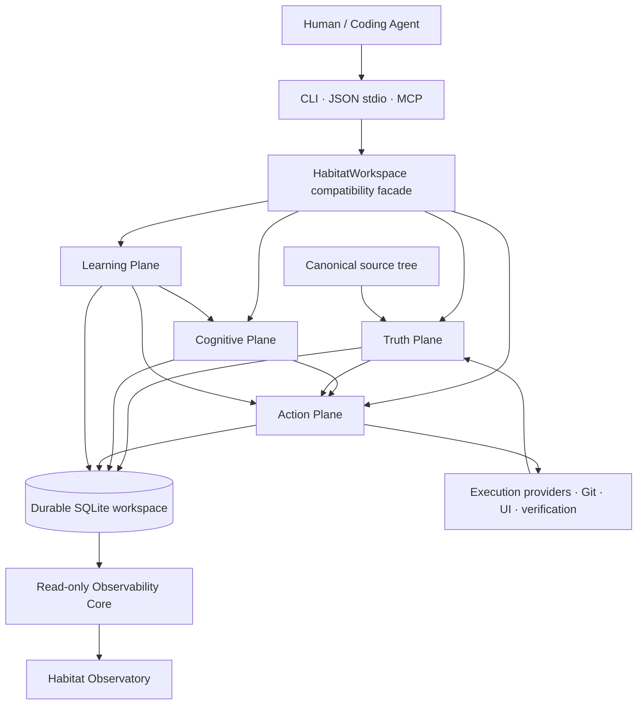

<p align="center">
  <a href="README.md">English</a>
  ·
  <a href="README-VN.md"><strong>Tiếng Việt</strong></a>
  ·
  <a href="README-CN.md">简体中文</a>
</p>

<h1 align="center">Nolane Habitat</h1>

<p align="center">
  <strong>Trí tuệ dự án bền vững cho coding agent.</strong>
</p>

<p align="center">
  Biến một cây mã nguồn thành một thế giới dự án có nhận thức revision, gắn chặt với evidence — nơi agent có thể quan sát, suy luận, chỉnh sửa, xác minh, checkpoint và tiếp tục công việc về sau.
</p>

<p align="center">
  <a href="https://github.com/Nolane-x/Nolane-habitat/releases/tag/v0.1.0-alpha.20">
    
  </a>
  
  <a href="https://github.com/Nolane-x/Nolane-habitat/actions/workflows/ci.yml">
    
  </a>
  <a href="https://github.com/Nolane-x/Nolane-habitat/actions/workflows/codeql.yml">
    
  </a>
</p>

---

## Habitat trong một câu

**Nolane Habitat là một project-intelligence substrate chạy local, cung cấp cho coding agent một môi trường bền vững, có governance và nhận thức revision quanh một dự án phần mềm — nhưng không bao giờ thay thế mã nguồn canonical làm sự thật.**

Nó không phải một lớp chat wrapper khác, không phải model AI, không phải vector database chung chung và cũng không phải một lớp giao diện IDE. Habitat là lớp nằm giữa agent và dự án thật: nơi source identity, semantic evidence, task context, project memory, execution receipt, mutation, verification, checkpoint và observability có thể cùng tồn tại trong một hệ thống thống nhất.

---

## Vì sao Habitat tồn tại

Một coding model rất mạnh vẫn có thể trở nên thiếu ổn định nếu môi trường xung quanh nó yếu.

Phần lớn coding-agent workflow hiện nay liên tục gặp những vấn đề mang tính cấu trúc giống nhau:

| Khi không có project substrate bền vững | Khi dùng Nolane Habitat |
| --- | --- |
| Mỗi session lại phải đọc và khám phá repo gần như từ đầu | Dự án có một durable workspace gắn với revision |
| Context window vừa phải làm working memory vừa phải làm long-term memory | Context residency và Project Memory được tách thành hai khái niệm khác nhau |
| Semantic result rất dễ bị đối xử như “sự thật” | Canonical source vẫn là authority; claim dẫn xuất giữ authority/provenance riêng |
| Agent sửa trực tiếp rồi mới nghĩ cách cứu khi có lỗi | Source change có thể stage, journal, commit, rollback và recover |
| Verification chỉ là một dòng terminal thoáng qua | Verification receipt và evidence có thể trở thành project state bền vững |
| Task dài dần biến thành một chuỗi chat rời rạc | Executive Trajectory giữ goal, strategy, milestone, budget, failure, recovery và closure |
| Assumption đã stale vẫn nằm trong prompt và tiếp tục ảnh hưởng | Epistemic state biểu diễn fact, assumption, unknown, contradiction, constraint và prediction |
| Agent mới chỉ nhận lại một đoạn prose tóm tắt | Checkpoint/resume và agent coordination giữ handoff state có cấu trúc |
| “Sandboxed” thường chỉ có nghĩa là “đã chạy được một process” | Capability claim được khai báo rõ và fail-honest; containment không chứng minh được thì không quảng cáo |
| Observability là log rải rác ở nhiều terminal | Observatory chiếu project/agent activity bền vững lên một surface read-only chuyên biệt |

Mục tiêu rất rõ: **làm cho môi trường quanh agent thông minh hơn, quan sát được hơn và khó bị đánh lừa hơn so với chỉ có một đống file cộng với shell.**

---

## Điều gì làm Nolane Habitat khác biệt

### 1. Canonical source luôn là sự thật

Habitat coi các file dự án thông thường là executable authority.

Semantic index, memory, summary, runtime inference, hypothesis do model tạo và graph projection đều có thể giúp agent suy luận — nhưng không được âm thầm vượt quyền source mà chúng đang mô tả.

Điều này quan trọng vì một project-intelligence system sẽ trở nên nguy hiểm nếu representation tiện lợi hơn vô tình có authority cao hơn code thật.

### 2. Một Project World bền vững, không chỉ retrieval

Habitat xây một thế giới nhận thức hướng dự án quanh source tree:

- semantic relationship và source anchor;
- Effect Twin, Dataflow Twin và Runtime Twin;
- Project World và counterfactual world gắn với revision;
- dependency cognition và Git cognition;
- task context và exact-source paging;
- Project Memory bền vững;
- epistemic item, hypothesis, experiment, invariant và verification evidence.

Kết quả không chỉ là “search result”. Đó là một project state có cấu trúc có thể tồn tại xuyên qua nhiều task và nhiều agent.

### 3. Evidence có provenance và authority

Foundation Convergence đưa vào một trust model tường minh cho các claim dẫn xuất.

Một cách hình dung hữu ích là:

`SOURCE_EXACT > OBSERVED_EXACT > COMPILER_PRECISE > PARSER_DERIVED > HEURISTIC_DERIVED > MODEL_INFERRED`

Memory không tự động nâng cấp sức mạnh của một claim. Một evidence yếu được nhớ lại ở phiên sau vẫn là evidence yếu.

Nhờ vậy tầng cognition phía trên có thể rất mạnh mà không làm mờ ranh giới giữa **thứ đã được quan sát**, **thứ được dẫn xuất** và **thứ chỉ được suy đoán**.

### 4. Context được compile, không phải dump cả repo

Habitat không cần nhét toàn bộ repository vào context window của agent.

Context Compiler / Context VM có thể tạo context giới hạn theo task, page exact source khi cần, dùng relationship cấu trúc và giữ thông tin residency/utility. Lợi ích thực tế là giảm context thrash và làm rõ ranh giới giữa “thứ agent đang nhìn thấy” với “thứ Habitat biết một cách bền vững”.

### 5. Mutation là một governed operation

Habitat có mutation layer với source authority, transaction state, journaling, conflict detection, rollback, recovery, approval, path lease và revision invalidation.

Sự thay đổi quan trọng ở đây là cách nhìn:

> Một source edit không chỉ là text generation. Nó là một state transition có governance trên một dự án thật.

### 6. Công việc dài hạn có Executive Trajectory

Với task dài, Habitat có thể duy trì một trajectory tường minh chứa:

- goal và episode binding;
- strategy generation và switching;
- milestone dependency DAG;
- hard budget và provider-reported budget;
- verification requirement;
- failure memory;
- recovery và continuation;
- completion gate cuối cùng.

Nhờ đó long-running work có một control structure bền vững thay vì phụ thuộc vào việc model phải nhớ mọi quyết định cũ trong một prompt khổng lồ.

### 7. Cho phép learning — nhưng constitutional rule không được phép bị học mất

Learning Plane có thể đánh giá và promote **soft policy** như retrieval weight, graph depth, context budget, strategy prior, verifier scheduling hoặc provider selection.

Nhưng nó bị cấm học để loại bỏ những hard invariant như:

- canonical source authority;
- path escape check;
- revision freshness;
- mutation recovery rule;
- approval requirement;
- containment truthfulness;
- secret-redaction boundary;
- release-governance rule;
- authority ordering.

Adaptation chỉ có giá trị khi nó không thể tối ưu hóa mất những luật giúp hệ thống đáng tin cậy.

### 8. Execution capability phải fail-honest

Habitat tách riêng “có thể execute” khỏi “đã được isolate”.

Local process mặc định có thể được mô tả là `trusted-local-process`; các claim mạnh hơn về sandbox/filesystem/network/process isolation chỉ xuất hiện khi execution provider đang hoạt động đưa ra đủ containment evidence cần thiết.

Đây là chủ ý bảo thủ. Thiếu bằng chứng sẽ trở thành unknown/unsupported capability — không trở thành marketing claim.

### 9. Observatory là projection, không phải authority

Habitat Observatory là một loopback, read-only projection trên durable state và operator activity.

Nó có thể hiển thị project activity, world state, execution, UI/operator context, trajectory và timeline mà không biến thành một mutation path thứ hai. Visual layer hữu ích vì con người có thể quan sát agent/environment đang làm gì mà không biến giao diện hiển thị thành quyền điều khiển ẩn.

### 10. Release engineering cũng là một phần của sản phẩm

Habitat coi test, recovery, reproducibility, release identity, evidence provenance và promotion gate là những engineering surface hạng nhất.

Release `v0.1.0-alpha.20` không chỉ có binary artifact mà đi kèm machine-readable closure evidence, release admission record, checksum và verification bundle.

---

## Kiến trúc

Cách dễ nhất để hiểu Habitat là bốn plane phối hợp quanh một durable workspace.



### Truth Plane

Sở hữu authority có thể kiểm tra cơ học:

- source identity, revision, digest, Merkle state;
- source anchor và observed receipt;
- evidence provenance và staleness;
- hard invariant;
- capability attestation;
- mutation/release authority boundary.

### Cognitive Plane

Xây derived project intelligence:

- Semantic Fabric;
- Project World;
- Context Compiler / Context VM;
- Effect/Dataflow/Runtime Twin;
- Project Memory;
- epistemic state;
- hypothesis và experiment;
- counterfactual world;
- executive planning input.

### Action Plane

Sở hữu operation có thể thay đổi trạng thái:

- mutation stage/commit/rollback;
- execution provider;
- browser/UI action;
- verification;
- lease và approval;
- multi-agent invalidation;
- checkpoint/resume continuity.

### Learning Plane

Cải tiến soft policy dưới controlled evaluation:

- outcome ledger;
- ablation/causal experiment;
- policy candidate;
- shadow/canary evaluation;
- promotion gate;
- exact rollback;
- held-out benchmark.

---

## Agent loop thực tế

Một workflow hữu ích với Habitat:

```text
TASK
  ↓
START / ORIENT
  ↓
COMPILE BOUNDED CONTEXT
  ↓
INSPECT OBJECTS + EXACT SOURCE + REFERENCES
  ↓
FORM / UPDATE EPISTEMIC STATE
  ↓
STAGE GOVERNED CHANGE
  ↓
COMMIT OR ROLLBACK
  ↓
VERIFY AFFECTED SURFACE
  ↓
RECORD EVIDENCE
  ↓
CHECKPOINT
  ↓
RESUME WITH THE NEXT AGENT / SESSION
```

Loop này làm cho bốn thứ vốn thường chỉ tồn tại tạm thời trong coding-agent system trở thành durable:

**understanding → action → evidence → handoff**

---

## Bản đồ năng lực chính

| Năng lực | Habitat cung cấp gì | Vì sao quan trọng |
| --- | --- | --- |
| Durable workspace | Project state dùng SQLite và gắn revision | Project knowledge sống lâu hơn một prompt/session |
| Source authority | Canonical project bytes luôn là authority | Representation dẫn xuất không thể âm thầm thay thế thực tế |
| Semantic Fabric | Semantic evidence theo provider, source anchor, disagreement handling | Navigation tốt hơn nhưng vẫn có provenance |
| Context system | Orientation, bounded context, exact-source paging, residency | Giảm lãng phí context window và context thrash |
| Project World | Semantic/effect/dataflow/runtime relationship | Cho agent suy luận trên cấu trúc và hành vi dự án |
| Project Memory | Semantic, episodic, procedural, failure, decision, experiment record | Học bền vững từ công việc trước |
| Epistemic Runtime | Fact, assumption, unknown, contradiction, constraint, prediction | Biến uncertainty thành thứ có thể quan sát |
| Executive Trajectory | Goal, strategy, milestone, budget, recovery, completion gate | Task dài có durable control structure |
| Governed mutation | Stage, commit, rollback, journal, recovery, lease, invalidation | Tiến hóa source an toàn hơn |
| Execution Fabric | Provider capability và containment attestation | Ngăn sandbox claim không có bằng chứng |
| Verification | Verification plan, execution receipt, evidence binding | Biến “đã pass” thành claim bền vững có provenance |
| Multi-agent coordination | Agent handle, lease, invalidation, checkpoint/resume | Handoff có cấu trúc và biết xung đột |
| UI / browser cognition | Semantic UI handle, observation, action receipt | Browser work có thể trở thành project activity gắn evidence |
| Benchmark Lab | Controlled suite, metric, ablation, held-out evaluation | Đo được mechanism nào thật sự giúp |
| Learning Plane | Immutable policy candidate, evaluation, promotion, rollback | Cải tiến có kiểm soát mà không sửa invariant |
| Observatory | Read-only project/agent projection | Con người nhìn thấy hệ thống mà không cấp mutation authority |
| Release admission | Machine-readable evidence, identity gate, checksum | Release claim có thể audit |

---

## Cấu trúc dự án

Repository được tổ chức quanh runtime substrate, evidence/learning infrastructure, test surface và integration.

```text
Nolane-habitat/
├── habitat/                     # Core runtime package
│   ├── truth/                   # Authority, claim, evidence, provenance
│   ├── semantic/                # Semantic provider và semantic fabric
│   ├── context/                 # Context service / task-context machinery
│   ├── learning_plane/          # Soft-policy evaluation, promotion, rollback
│   ├── services/                # Focused domain service boundaries
│   ├── repositories/            # Durable storage access theo domain
│   ├── operations/              # Registered protocol/runtime operations
│   ├── security/                # Security và capability boundaries
│   ├── ui/                      # UI runtime/operator support
│   ├── benchmarking/            # Benchmark và evaluation services
│   ├── backends/                # Source / execution backend boundaries
│   │
│   ├── workspace.py             # Public workspace compatibility facade
│   ├── _workspace_core.py       # Compatibility/core implementation surface lớn
│   ├── project_world.py         # Project World representation
│   ├── effect_twin.py           # Effect relationships
│   ├── dataflow_twin.py         # Dataflow relationships
│   ├── runtime_twin.py          # Runtime evidence/twin
│   ├── mutation.py              # Governed source mutation
│   ├── execution.py             # Execution provider orchestration
│   ├── executive.py             # Executive Trajectory primitives
│   ├── operation_registry.py    # Operation metadata/dispatch registry
│   ├── policy.py                # Policy / approval behavior
│   ├── observability.py         # Durable observability/read models
│   ├── observatory.py           # Observatory entry point
│   ├── observatory_frontend.py  # Cinematic projection frontend
│   ├── protocol.py              # Agent protocol surface
│   ├── server.py                # JSON stdio agent server
│   ├── mcp_adapter.py           # MCP adapter
│   └── cli.py                   # Human/operator CLI
│
├── tests/                       # Regression, adversarial, recovery, protocol, release tests
├── benchmarks/                  # A/B, stress, navigation, scale và demo workload
├── docs/                        # Architecture, security, runbook và integration docs
├── examples/                    # Usage examples
├── plugins/                     # Bundled agent/Codex plugin surfaces
├── artifacts/                   # Build/evidence artifacts được giữ trong repo
├── .github/workflows/           # Habitat CI và CodeQL
├── CHANGELOG.md
├── VERSION
└── pyproject.toml
```

Một design choice quan trọng: Habitat **không** chia core state thành một đội microservice. Domain repository có thể tách theo trách nhiệm trong code, trong khi workspace vẫn giữ một SQLite unit-of-work thống nhất.

---

## Bắt đầu nhanh

Yêu cầu Python **3.10+**.

### Windows

```powershell
git clone https://github.com/Nolane-x/Nolane-habitat.git
cd Nolane-habitat

python -m venv .venv
.\.venv\Scripts\python -m pip install -U pip
.\.venv\Scripts\python -m pip install -U "setuptools>=68"
.\.venv\Scripts\python -m pip install -e ".[dev,mcp,python-semantic]"
```

Tạo Habitat workspace nằm cạnh source project:

```powershell
$source = (Resolve-Path .).Path
$workspace = "$source.habitat"

.\.venv\Scripts\habitat.exe create $source $workspace
.\.venv\Scripts\habitat.exe enter $workspace
.\.venv\Scripts\habitat.exe orient $workspace "map the authentication flow"
```

### macOS / Linux

```bash
git clone https://github.com/Nolane-x/Nolane-habitat.git
cd Nolane-habitat

python -m venv .venv
.venv/bin/python -m pip install -U pip
.venv/bin/python -m pip install -U "setuptools>=68"
.venv/bin/python -m pip install -e '.[dev,mcp,python-semantic]'
```

Tạo và orient workspace:

```bash
source="$(pwd)"
workspace="${source}.habitat"

.venv/bin/habitat create "$source" "$workspace"
.venv/bin/habitat enter "$workspace"
.venv/bin/habitat orient "$workspace" "map the authentication flow"
```

> **Hãy để Habitat workspace tách khỏi source directory.**  
> Source tree vẫn là canonical project; workspace `.habitat` giữ durable project state của Habitat.

---

## Những command nên học đầu tiên

### Kiểm tra sức khỏe workspace

```bash
habitat doctor ./project.habitat
```

`doctor` hiển thị schema state, SQLite integrity, foreign-key health và journal information trước khi state hỏng hoặc stale trở thành agent context.

### Xem execution boundary thật sự

```bash
habitat capabilities ./project.habitat
habitat execution-security ./project.habitat
```

Nên làm bước này trước khi giao cho agent chạy code có hậu quả đáng kể.

### Refresh project state

```bash
habitat refresh ./project.habitat
```

### Orient theo task

```bash
habitat orient ./project.habitat "find where access tokens are validated"
```

### Query và inspect

```bash
habitat query ./project.habitat "credential validation"
habitat inspect ./project.habitat <object-id> --source body
habitat source-read ./project.habitat path/to/file.py --start-line 1 --max-lines 200
```

### Quan sát relationship của dự án

```bash
habitat dependencies ./project.habitat
habitat git-status ./project.habitat
habitat git-history ./project.habitat --path path/to/file.py
```

### Stage một governed source mutation

```bash
habitat stage-replace-text ./project.habitat path/to/file.py "old text" "new text"
```

Hoặc thao tác trên semantic symbol:

```bash
habitat stage-symbol ./project.habitat <symbol-id> "<new source>"
habitat stage-rename ./project.habitat <symbol-id> <new-name>
```

Sau đó commit hoặc rollback transaction được trả về:

```bash
habitat commit ./project.habitat <transaction-id>
habitat rollback ./project.habitat <transaction-id>
```

### Tạo verification plan

```bash
habitat verify-plan ./project.habitat path/to/changed.py
```

### Checkpoint và resume

```bash
habitat checkpoint ./project.habitat "finish auth refactor" <object-id> <object-id>
habitat resume ./project.habitat <session-id>
```

CLI chủ yếu cung cấp compatibility/operator workflow. Agent-native integration có thể dùng JSON protocol hoặc MCP trực tiếp.

---

## Dùng Habitat với Codex qua MCP

Cài MCP extra, khởi tạo workspace rồi đăng ký adapter.

### Windows

```powershell
$python = (Resolve-Path .\.venv\Scripts\python.exe).Path
codex mcp add nolane-habitat -- $python -m habitat.mcp_adapter $workspace --no-open-observatory
codex mcp list
```

Cài bundled skills:

```powershell
$repo = (Resolve-Path .).Path
codex plugin marketplace add $repo
codex plugin add nolane-habitat@personal
```

Plugin gồm:

- `$nolane-habitat` — dùng Habitat cho grounded project work;
- `$nolane-habitat-maintainer` — maintain, test, package và release chính Habitat.

MCP surface bao gồm workflow cho task/context, inspection, references, source evolution, verification, UI investigation, checkpoint và resume. Xem [Codex integration](docs/CODEX-INTEGRATION.md) để có setup chính xác.

---

## Ví dụ: agent có thể dùng Habitat như thế nào

Giả sử task là:

> “Đổi tên authentication token validator mà không làm hỏng caller.”

Một Habitat-oriented workflow có thể là:

1. **Start/orient task** để context được compile quanh authentication.
2. **Inspect semantic object** đại diện validator.
3. **Theo references** thay vì đoán caller chỉ từ lexical search.
4. **Đọc exact source** ở các site mơ hồ hoặc có impact cao.
5. **Stage rename** qua governed mutation path.
6. **Để revision invalidation lộ ra stale context** phát sinh sau source change.
7. **Chạy verification plan** cho các path bị ảnh hưởng.
8. **Persist evidence/receipt** thay vì để kết quả trôi mất trong terminal scrollback.
9. **Checkpoint task** cùng những project object quan trọng và next action.
10. **Resume về sau** mà không phải xây lại toàn bộ câu chuyện của dự án.

Habitat không đảm bảo mọi rename đều đúng semantic trong mọi ngôn ngữ. Nó cho agent một environment mạnh hơn để tạo thay đổi, kiểm tra thay đổi và giải thích vì sao thay đổi đó đáng tin.

---

## Truth, confidence và uncertainty

Habitat chủ động tách **authority** khỏi **confidence**.

Model có thể tự tin 99% mà vẫn sai. Một compiler-derived reference có thể khô khan nhưng lại là evidence mạnh hơn cho một rename site.

Authority model vì thế đặt những câu hỏi như:

- Đây có phải exact source không?
- Có phải direct observation không?
- Semantic provider nào tạo ra nó?
- Provider version nào?
- Ở workspace revision nào?
- Nó phụ thuộc vào evidence nào?
- Source đã thay đổi từ lúc đó chưa?
- Claim đang active, stale, contradicted, superseded hay rejected?

Đó là nền tảng tốt hơn cho agent reasoning so với việc coi mọi câu được retrieve đều có độ đáng tin như nhau.

---

## Ranh giới an toàn và capability

Habitat được thiết kế để **fail-honest**, không phải để giả vờ an toàn tuyệt đối.

### Habitat có claim

- source/project state nhận thức revision;
- evidence/provenance surface tường minh;
- governed mutation và recovery machinery;
- capability inspection;
- release và verification evidence;
- read-only Observatory boundary;
- controlled Learning Plane promotion/rollback.

### Habitat không claim

- AGI;
- universal program correctness;
- universal semantic precision cho mọi ngôn ngữ;
- theorem prover cho mọi hành vi phần mềm;
- independently verified provider billing/token truth;
- hostile-code microVM isolation trên mọi host;
- universal causal inference từ telemetry;
- production SLO/performance superiority chỉ dựa vào CI measurement.

Nếu execution provider hiện tại chỉ là trusted local process, Habitat phải nói đúng như vậy.

---

## Foundation Convergence: alpha.20 đã đóng những gì

Release `0.1.0-alpha.20` đóng chương trình **Foundation Convergence** được định nghĩa trong repository.

Closure certification yêu cầu đủ 12 exit criteria cùng pass, bao gồm:

1. compatibility của public protocol/MCP;
2. workspace migration/open không phá dữ liệu;
3. semantic precision evidence trên nhiều language/provider;
4. provenance và authority tường minh cho semantic/evidence object quan trọng;
5. read-only state neutrality;
6. mutation/recovery/fault-injection health;
7. controlled cognitive ablation;
8. soft-policy improvement trên held-out task qua independent gate;
9. exact policy rollback behavior;
10. machine-consistent release identity;
11. constitutional invariant không thể bị Learning Plane ghi đè;
12. tắt Observatory mà core vẫn hoạt động.

Release `v0.1.0-alpha.20` đã công bố kèm:

- wheel và source distribution;
- `release-manifest.json`;
- `promotion-verdict.json`;
- `maintainer-authorization.json`;
- `foundation-convergence-closure.json`;
- verification report cho truth, compatibility, protocol, recovery, reproducibility và Semgrep;
- `release-closure-summary.json`;
- `SHA256SUMS.txt`;
- `nolane-habitat-0.1.0-alpha.20-verification-bundle.zip`.

**Release:** [Nolane Habitat v0.1.0-alpha.20](https://github.com/Nolane-x/Nolane-habitat/releases/tag/v0.1.0-alpha.20)

---

## Verification

Chạy test matrix của repository từ development checkout đã cài đặt:

### Windows

```powershell
.\.venv\Scripts\python tools\run_test_matrix.py --workers 1 --timeout 180
```

### macOS / Linux

```bash
.venv/bin/python tools/run_test_matrix.py --workers 1 --timeout 180
```

GitHub Actions surface còn có:

- **Habitat CI** — regression, semantic precision, Foundation certification, compatibility, protocol, recovery, fault injection, reproducible build, distribution và workflow policy check;
- **CodeQL** — phân tích Python và JavaScript/TypeScript.

---

## Tài liệu

Nên bắt đầu từ đây:

| Tài liệu | Mục đích |
| --- | --- |
| [Installation](docs/INSTALLATION.md) | Cài Habitat và tạo workspace |
| [Codex integration](docs/CODEX-INTEGRATION.md) | Đăng ký MCP và bundled skills |
| [Agent protocol](docs/AGENT-PROTOCOL.md) | Hiểu protocol hướng agent |
| [Capability matrix](docs/security/CAPABILITY-MATRIX.md) | Hiểu execution/containment claim |
| [Release admission](docs/runbooks/RELEASE-ADMISSION.md) | Đánh giá release admission evidence |
| [Foundation Convergence](docs/design/FOUNDATION-CONVERGENCE.md) | Architecture và closure model |
| [Implementation status](docs/IMPLEMENTATION-STATUS.md) | Phần đã implement, bounded và không claim |
| [Limitations](docs/LIMITATIONS.md) | Limitation và non-claim tường minh |
| [Changelog](CHANGELOG.md) | Release history hiện tại |

---

## Habitat phù hợp với ai

Habitat đặc biệt hữu ích nếu bạn đang xây dựng hoặc vận hành:

- coding agent làm việc lặp lại trên cùng repository;
- long-horizon software-engineering agent;
- multi-agent coding workflow;
- agent system cần durable handoff;
- research system về project cognition, context selection hoặc tool use;
- governed code-generation pipeline;
- local agent runtime cần source/evidence boundary rõ ràng;
- môi trường mà câu hỏi “vì sao agent tin điều này?” thực sự quan trọng.

Nếu bạn chỉ cần one-shot code completion cho một file nhỏ, Habitat có thể là quá nhiều infrastructure so với nhu cầu.

---

## Nguyên tắc thiết kế

Habitat được xây quanh một nhóm nguyên tắc nhỏ nhưng cứng:

1. **Source trước summary.**
2. **Evidence trước claim.**
3. **Revision trước reuse.**
4. **Authority trước confidence.**
5. **Stage trước commit.**
6. **Verification trước closure.**
7. **Memory nhưng không được nâng quyền thành source truth.**
8. **Learning nhưng không được sửa constitutional invariant.**
9. **Observability nhưng không có hidden control authority.**
10. **Fail closed khi hệ thống không chứng minh được claim mạnh hơn.**

---

## Trạng thái hiện tại

**Current package line:** `0.1.0-alpha.20`  
**Python:** `>=3.10`  
**Stage:** research prototype / alpha  
**Primary integration:** local CLI, JSON stdio agent protocol, MCP/Codex  
**Canonical source authority:** ordinary project files  
**Durable state:** local SQLite workspace

Nolane Habitat đang được phát triển như một agent-native project cognition environment. Hệ thống đã đủ rộng để hỗ trợ nhiều workflow dự án thật, nhưng nhãn alpha là có chủ ý: các claim quan trọng về semantic, isolation, performance và cross-environment vẫn được giữ giới hạn và phải đi kèm evidence.

---

<p align="center">
  <strong>Đừng chỉ đưa cho agent các file. Hãy cho nó một habitat.</strong>
</p>

<p align="center">
  <a href="README.md">English</a>
  ·
  <a href="README-VN.md">Tiếng Việt</a>
  ·
  <a href="README-CN.md">简体中文</a>
</p>
