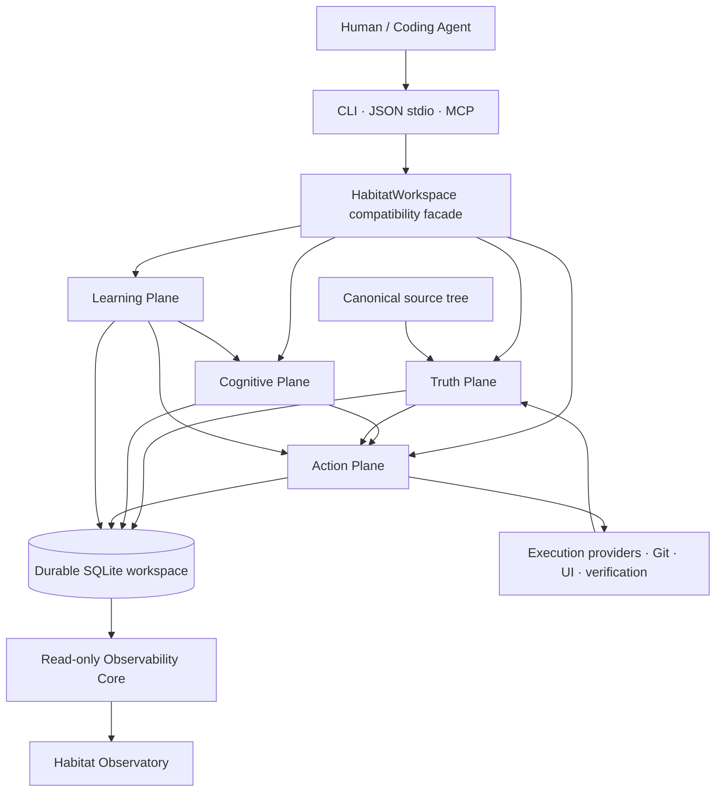

<p align="center">
  <a href="README.md"><strong>English</strong></a>
  ·
  <a href="README-VN.md">Tiếng Việt</a>
  ·
  <a href="README-CN.md">简体中文</a>
</p>

<h1 align="center">Nolane Habitat</h1>

<p align="center"><strong>Nolane Habitat 0.1.0-alpha.20</strong></p>

<p align="center">
  <strong>Durable project intelligence for coding agents.</strong>
</p>

<p align="center">
  Turn a source tree into a revision-aware, evidence-bound project world that an agent can inspect, reason over, change, verify, checkpoint, and resume.
</p>

<p align="center">
  <a href="https://github.com/Nolane-x/Nolane-habitat/releases/tag/v0.1.0-alpha.20">
    
  </a>
  
  <a href="https://github.com/Nolane-x/Nolane-habitat/actions/workflows/ci.yml">
    
  </a>
  <a href="https://github.com/Nolane-x/Nolane-habitat/actions/workflows/codeql.yml">
    
  </a>
</p>

---

## Habitat in one sentence

**Nolane Habitat is a local project-intelligence substrate that gives coding agents a durable, governed, revision-aware environment around a software project — without replacing canonical source files as truth.**

It is not another chat wrapper, not a model, not a generic vector database, and not an IDE skin. Habitat is the layer between an agent and a real project: a place where source identity, semantic evidence, task context, project memory, execution receipts, mutations, verification, checkpoints, and observability can live together.

---

## Why Habitat exists

A capable coding model can still become unreliable when its environment is weak.

Most coding-agent workflows repeatedly hit the same structural problems:

| Without a durable project substrate | With Nolane Habitat |
| --- | --- |
| Every session re-discovers the repository from files and search | The project has a durable workspace with revision-aware state |
| Context windows are used as both working memory and long-term memory | Context residency and Project Memory are separate concepts |
| Semantic results can silently become “truth” | Canonical source remains authoritative; derived claims carry authority/provenance |
| Edits happen directly, then the agent tries to recover if something breaks | Source changes can be staged, journaled, committed, rolled back, and recovered |
| Verification is a transient terminal event | Verification receipts and evidence can become durable project state |
| Long tasks degrade into loosely connected chat turns | Executive Trajectory tracks goals, strategy, milestones, budgets, failures, recovery, and closure |
| Assumptions become stale but remain in the prompt | Epistemic state models facts, assumptions, unknowns, contradictions, constraints, and predictions |
| A new agent inherits prose, not structured project state | Checkpoint/resume and agent coordination preserve durable handoff state |
| “Sandboxed” often means “a process was launched somewhere” | Capability claims are explicit and fail-honest; unsupported containment is not advertised |
| Observability is logs scattered across terminals | Observatory projects durable read-only project/agent activity into a dedicated visual surface |

The goal is simple: **make the environment around the agent more intelligent, more inspectable, and harder to fool than a pile of files plus a shell.**

---

## What makes Nolane Habitat different

### 1. Canonical source stays truth

Habitat treats ordinary project files as the executable authority.

Semantic indexes, memories, summaries, runtime inferences, model-produced hypotheses, and graph projections can help an agent reason — but they do not silently outrank the source they describe.

This matters because a project-intelligence system becomes dangerous when a convenient representation can accidentally gain more authority than the real code.

### 2. A durable Project World, not just retrieval

Habitat builds a project-oriented cognitive world around the source tree:

- semantic relationships and source anchors;
- Effect Twin, Dataflow Twin, and Runtime Twin;
- Project World and revision-bound counterfactual worlds;
- dependency and Git cognition;
- task context and exact-source paging;
- durable Project Memory;
- epistemic items, hypotheses, experiments, invariants, and verification evidence.

The result is not merely “search results.” It is a structured project state that can survive across tasks and agents.

### 3. Evidence has provenance and authority

Foundation Convergence introduced an explicit trust model for derived claims.

A useful mental model is:

`SOURCE_EXACT > OBSERVED_EXACT > COMPILER_PRECISE > PARSER_DERIVED > HEURISTIC_DERIVED > MODEL_INFERRED`

Memory does not magically upgrade a claim. Recalling weak evidence later does not make it stronger.

That lets higher-level cognition stay powerful without blurring the line between **what was observed**, **what was derived**, and **what was inferred**.

### 4. Context is compiled, not dumped

Habitat does not need to hand the entire repository to an agent.

The Context Compiler / Context VM can build bounded task-oriented context, page exact source on demand, use structural relationships, and preserve residency/utility information. The practical benefit is less context thrash and a clearer boundary between “what the agent currently sees” and “what Habitat durably knows.”

### 5. Mutations are governed operations

Habitat includes a mutation layer with source authority, transaction state, journaling, conflict detection, rollback, recovery, approvals, path leases, and revision invalidation.

The important shift is philosophical:

> A source edit is not merely text generation. It is a governed state transition over a real project.

### 6. Long-horizon work has an Executive Trajectory

For longer tasks, Habitat can preserve an explicit trajectory containing:

- goal and episode binding;
- strategy generation and switching;
- milestone dependency DAGs;
- hard and provider-reported budgets;
- verification requirements;
- failure memory;
- recovery and continuation;
- final completion gates.

This gives long-running work a durable control structure instead of relying on a model to remember every earlier decision inside a single prompt.

### 7. Learning is allowed — but constitutional rules are not learnable

The Learning Plane can evaluate and promote **soft policies** such as retrieval weights, graph depth, context budgets, strategy priors, verifier scheduling, or provider selection.

It is explicitly not allowed to learn away hard invariants such as:

- canonical source authority;
- path escape checks;
- revision freshness;
- mutation recovery rules;
- approval requirements;
- containment truthfulness;
- secret-redaction boundaries;
- release-governance rules;
- authority ordering.

Adaptation is useful only when it cannot optimize away the rules that make the system trustworthy.

### 8. Execution capabilities are fail-honest

Habitat separates “can execute” from “is isolated.”

The default local process can be reported as a `trusted-local-process`; stronger sandbox/filesystem/network/process-isolation claims only appear when the active provider supplies the required containment evidence.

This is intentionally conservative. A missing proof becomes an unknown or unsupported capability — not a marketing claim.

### 9. Observatory is a projection, not an authority

The Habitat Observatory is a loopback, read-only projection over durable state and operator activity.

It can visualize project activity, world state, execution, UI/operator context, trajectories, and timelines without becoming a second mutation path. The visual layer is useful because humans can inspect what the agent/environment is doing without turning presentation into control authority.

### 10. Release engineering is part of the product

Habitat treats tests, recovery, reproducibility, release identity, evidence provenance, and promotion gates as first-class engineering surfaces.

The `v0.1.0-alpha.20` release is accompanied by machine-readable closure evidence, release admission records, checksums, and a verification bundle rather than only a binary artifact.

---

## The architecture

Habitat is easiest to understand as four cooperating planes around one durable workspace.



### Truth Plane

Owns mechanically inspectable authority:

- source identity, revisions, digests, Merkle state;
- source anchors and observed receipts;
- evidence provenance and staleness;
- hard invariants;
- capability attestations;
- mutation/release authority boundaries.

### Cognitive Plane

Builds derived project intelligence:

- Semantic Fabric;
- Project World;
- Context Compiler / Context VM;
- Effect/Dataflow/Runtime Twins;
- Project Memory;
- epistemic state;
- hypotheses and experiments;
- counterfactual worlds;
- executive planning inputs.

### Action Plane

Owns state-changing operations:

- mutation stage/commit/rollback;
- execution providers;
- browser/UI actions;
- verification;
- leases and approvals;
- multi-agent invalidation;
- checkpoint/resume continuity.

### Learning Plane

Improves soft policy under controlled evaluation:

- outcome ledger;
- ablation/causal experiments;
- policy candidates;
- shadow/canary evaluation;
- promotion gates;
- exact rollback;
- held-out benchmarks.

---

## The practical agent loop

A useful Habitat workflow is:

```text
TASK
  ↓
START / ORIENT
  ↓
COMPILE BOUNDED CONTEXT
  ↓
INSPECT OBJECTS + EXACT SOURCE + REFERENCES
  ↓
FORM / UPDATE EPISTEMIC STATE
  ↓
STAGE GOVERNED CHANGE
  ↓
COMMIT OR ROLLBACK
  ↓
VERIFY AFFECTED SURFACE
  ↓
RECORD EVIDENCE
  ↓
CHECKPOINT
  ↓
RESUME WITH THE NEXT AGENT / SESSION
```

That loop makes four things durable that are usually transient in coding-agent systems:

**understanding → action → evidence → handoff**

---

## Core capability map

| Capability | What Habitat provides | Why it matters |
| --- | --- | --- |
| Durable workspace | SQLite-backed, revision-aware project state | Project knowledge survives beyond one prompt/session |
| Source authority | Canonical project bytes remain authoritative | Derived representations cannot silently replace reality |
| Semantic Fabric | Provider-aware semantic evidence, source anchors, disagreement handling | Better navigation with explicit provenance |
| Context system | Orientation, bounded context, exact-source paging, residency | Less context-window waste and thrash |
| Project World | Semantic/effect/dataflow/runtime relationships | Lets agents reason over project structure and behavior |
| Project Memory | Semantic, episodic, procedural, failure, decision, experiment records | Durable learning from previous work |
| Epistemic Runtime | Facts, assumptions, unknowns, contradictions, constraints, predictions | Makes uncertainty inspectable instead of implicit |
| Executive Trajectory | Goals, strategies, milestones, budgets, recovery, completion gates | Long tasks get a durable control structure |
| Governed mutation | Stage, commit, rollback, journal, recovery, leases, invalidation | Safer project evolution |
| Execution Fabric | Provider capabilities and containment attestations | Prevents unsupported sandbox claims |
| Verification | Verification plans, execution receipts, evidence bindings | Makes “it passed” a durable claim with provenance |
| Multi-agent coordination | Agent handles, leases, invalidations, checkpoint/resume | Better structured handoffs and conflict awareness |
| UI / browser cognition | Semantic UI handles, observations, action receipts | Browser work can become evidence-bound project activity |
| Benchmark Lab | Controlled suites, metrics, ablations, held-out evaluation | Measures whether a mechanism actually helps |
| Learning Plane | Immutable policy candidates, evaluation, promotion, rollback | Allows controlled improvement without rewriting invariants |
| Observatory | Read-only project/agent projection | Human-visible inspection without mutation authority |
| Release admission | Machine-readable evidence, identity gates, checksums | Release claims remain auditable |

---

## Project structure

The repository is organized around the runtime substrate, its evidence/learning infrastructure, test surfaces, and integrations.

```text
Nolane-habitat/
├── habitat/                     # Core runtime package
│   ├── truth/                   # Authority, claims, evidence, provenance
│   ├── semantic/                # Semantic providers and semantic fabric
│   ├── context/                 # Context services / task context machinery
│   ├── learning_plane/          # Soft-policy evaluation, promotion, rollback
│   ├── services/                # Focused domain service boundaries
│   ├── repositories/            # Repository-oriented durable storage access
│   ├── operations/              # Registered protocol/runtime operations
│   ├── security/                # Security and capability boundaries
│   ├── ui/                      # UI runtime/operator support
│   ├── benchmarking/            # Benchmark and evaluation services
│   ├── backends/                # Source / execution backend boundaries
│   │
│   ├── workspace.py             # Public workspace compatibility facade
│   ├── _workspace_core.py       # Large compatibility/core implementation surface
│   ├── project_world.py         # Project World representation
│   ├── effect_twin.py           # Effect relationships
│   ├── dataflow_twin.py         # Dataflow relationships
│   ├── runtime_twin.py          # Runtime evidence/twin
│   ├── mutation.py              # Governed source mutation
│   ├── execution.py             # Execution provider orchestration
│   ├── executive.py             # Executive Trajectory primitives
│   ├── operation_registry.py    # Operation metadata/dispatch registry
│   ├── policy.py                # Policy / approval behavior
│   ├── observability.py         # Durable observability/read models
│   ├── observatory.py           # Observatory entry point
│   ├── observatory_frontend.py  # Cinematic projection frontend
│   ├── protocol.py              # Agent protocol surface
│   ├── server.py                # JSON stdio agent server
│   ├── mcp_adapter.py           # MCP adapter
│   └── cli.py                   # Human/operator CLI
│
├── tests/                       # Regression, adversarial, recovery, protocol, release tests
├── benchmarks/                  # A/B, stress, navigation, scale and demo workloads
├── docs/                        # Architecture, security, runbooks and integration docs
├── examples/                    # Usage examples
├── plugins/                     # Bundled agent/Codex plugin surfaces
├── artifacts/                   # Repository-held build/evidence artifacts
├── .github/workflows/           # Habitat CI and CodeQL
├── CHANGELOG.md
├── VERSION
└── pyproject.toml
```

A key design choice is that Habitat does **not** split its core state across a fleet of microservices. Domain repositories can be separated by responsibility while the workspace retains a single SQLite unit-of-work model.

---

## Quick start

Python **3.10+** is required.

### Windows

```powershell
git clone https://github.com/Nolane-x/Nolane-habitat.git
cd Nolane-habitat

python -m venv .venv
.\.venv\Scripts\python -m pip install -U pip
.\.venv\Scripts\python -m pip install -U "setuptools>=68"
.\.venv\Scripts\python -m pip install -e ".[dev,mcp,python-semantic]"
```

Create a Habitat workspace beside the source project:

```powershell
$source = (Resolve-Path .).Path
$workspace = "$source.habitat"

.\.venv\Scripts\habitat.exe create $source $workspace
.\.venv\Scripts\habitat.exe enter $workspace
.\.venv\Scripts\habitat.exe orient $workspace "map the authentication flow"
```

### macOS / Linux

```bash
git clone https://github.com/Nolane-x/Nolane-habitat.git
cd Nolane-habitat

python -m venv .venv
.venv/bin/python -m pip install -U pip
.venv/bin/python -m pip install -U "setuptools>=68"
.venv/bin/python -m pip install -e '.[dev,mcp,python-semantic]'
```

Create and orient a workspace:

```bash
source="$(pwd)"
workspace="${source}.habitat"

.venv/bin/habitat create "$source" "$workspace"
.venv/bin/habitat enter "$workspace"
.venv/bin/habitat orient "$workspace" "map the authentication flow"
```

> **Keep the Habitat workspace separate from the source directory.**  
> The source tree remains the canonical project; the `.habitat` workspace stores Habitat's durable project state.

---

## First commands to learn

### Check workspace health

```bash
habitat doctor ./project.habitat
```

`doctor` exposes schema state, SQLite integrity, foreign-key health, and journal information before damaged or stale state becomes agent context.

### Inspect the real execution boundary

```bash
habitat capabilities ./project.habitat
habitat execution-security ./project.habitat
```

Do this before asking an agent to run consequential code.

### Refresh project state

```bash
habitat refresh ./project.habitat
```

### Orient around a task

```bash
habitat orient ./project.habitat "find where access tokens are validated"
```

### Query and inspect

```bash
habitat query ./project.habitat "credential validation"
habitat inspect ./project.habitat <object-id> --source body
habitat source-read ./project.habitat path/to/file.py --start-line 1 --max-lines 200
```

### Inspect project relationships

```bash
habitat dependencies ./project.habitat
habitat git-status ./project.habitat
habitat git-history ./project.habitat --path path/to/file.py
```

### Stage a governed source mutation

```bash
habitat stage-replace-text ./project.habitat path/to/file.py "old text" "new text"
```

or operate on semantic symbols:

```bash
habitat stage-symbol ./project.habitat <symbol-id> "<new source>"
habitat stage-rename ./project.habitat <symbol-id> <new-name>
```

Then commit or roll back the returned transaction:

```bash
habitat commit ./project.habitat <transaction-id>
habitat rollback ./project.habitat <transaction-id>
```

### Build a verification plan

```bash
habitat verify-plan ./project.habitat path/to/changed.py
```

### Checkpoint and resume

```bash
habitat checkpoint ./project.habitat "finish auth refactor" <object-id> <object-id>
habitat resume ./project.habitat <session-id>
```

The CLI intentionally exposes compatibility/operator workflows. Agent-native integrations can use the JSON protocol or MCP directly.

---

## Use Habitat with Codex through MCP

Install the MCP extra, initialize a workspace, then register the adapter.

### Windows

```powershell
$python = (Resolve-Path .\.venv\Scripts\python.exe).Path
codex mcp add nolane-habitat -- $python -m habitat.mcp_adapter $workspace --no-open-observatory
codex mcp list
```

Install the bundled skills:

```powershell
$repo = (Resolve-Path .).Path
codex plugin marketplace add $repo
codex plugin add nolane-habitat@personal
```

The plugin includes:

- `$nolane-habitat` — use Habitat for grounded project work;
- `$nolane-habitat-maintainer` — maintain, test, package, and release Habitat itself.

The MCP surface includes task/context, inspection, references, source evolution, verification, UI investigation, checkpoint, and resume workflows. See [Codex integration](docs/CODEX-INTEGRATION.md) for the exact setup.

---

## Example: how an agent can use Habitat

Imagine the task:

> “Rename the authentication token validator without breaking callers.”

A Habitat-oriented workflow can look like this:

1. **Start/orient the task** so context is compiled around authentication.
2. **Inspect the semantic object** representing the validator.
3. **Follow references** instead of guessing callers from lexical search alone.
4. **Read exact source** for ambiguous or high-impact sites.
5. **Stage the rename** through the governed mutation path.
6. **Let revision invalidation surface stale context** caused by the source change.
7. **Run the verification plan** for affected paths.
8. **Persist the evidence/receipt** instead of leaving the result in terminal scrollback.
9. **Checkpoint the task** with the relevant project objects and next action.
10. **Resume later** without rebuilding the project story from scratch.

Habitat does not guarantee that every rename is semantically correct in every language. It gives the agent a stronger environment for making, checking, and explaining the change.

---

## Truth, confidence, and uncertainty

Habitat deliberately separates **authority** from **confidence**.

A model may be 99% confident and still be wrong. A compiler-derived reference may be low-level and inconvenient but stronger evidence for a rename site.

The authority model therefore asks questions such as:

- Was this exact source?
- Was it directly observed?
- Which semantic provider produced it?
- Which provider version?
- At which workspace revision?
- Which evidence does it depend on?
- Has the source changed since then?
- Is the claim active, stale, contradicted, superseded, or rejected?

That is a stronger foundation for agent reasoning than treating every retrieved sentence as equally trustworthy.

---

## Safety and capability boundaries

Habitat is designed to be **fail-honest**, not magically safe.

### Habitat does claim

- revision-aware source/project state;
- explicit evidence/provenance surfaces;
- governed mutation and recovery machinery;
- capability inspection;
- release and verification evidence;
- read-only Observatory boundaries;
- controlled Learning Plane promotion/rollback.

### Habitat does not claim

- AGI;
- universal program correctness;
- universal semantic precision across all languages;
- a theorem prover for arbitrary software behavior;
- independently verified provider billing/token truth;
- hostile-code microVM isolation on every host;
- universal causal inference from telemetry;
- production SLO/performance superiority from CI-only measurements.

If the active execution provider is only a trusted local process, Habitat should say exactly that.

---

## Foundation Convergence: what alpha.20 closed

The `0.1.0-alpha.20` release closes the repository-defined **Foundation Convergence** program.

The closure certification requires all 12 exit criteria to pass, including:

1. public protocol/MCP compatibility;
2. non-destructive workspace migration/opening;
3. multi-language/provider semantic precision evidence;
4. explicit provenance and authority for high-impact semantic/evidence objects;
5. read-only state neutrality;
6. mutation/recovery/fault-injection health;
7. controlled cognitive ablations;
8. independently gated soft-policy improvement on held-out tasks;
9. exact policy rollback behavior;
10. machine-consistent release identity;
11. constitutional invariants protected from learning;
12. Observatory disablement without disabling the core.

For the published `v0.1.0-alpha.20` release, the release surface includes:

- wheel and source distribution;
- `release-manifest.json`;
- `promotion-verdict.json`;
- `maintainer-authorization.json`;
- `foundation-convergence-closure.json`;
- verification reports for truth, compatibility, protocol, recovery, reproducibility and Semgrep;
- `release-closure-summary.json`;
- `SHA256SUMS.txt`;
- `nolane-habitat-0.1.0-alpha.20-verification-bundle.zip`.

**Release:** [Nolane Habitat v0.1.0-alpha.20](https://github.com/Nolane-x/Nolane-habitat/releases/tag/v0.1.0-alpha.20)

---

## Verification

Run the repository test matrix from an installed development checkout:

### Windows

```powershell
.\.venv\Scripts\python tools\run_test_matrix.py --workers 1 --timeout 180
```

### macOS / Linux

```bash
.venv/bin/python tools/run_test_matrix.py --workers 1 --timeout 180
```

The GitHub Actions surface also includes:

- **Habitat CI** — regression, semantic precision, Foundation certification, compatibility, protocol, recovery, fault injection, reproducible build, distribution and workflow policy checks;
- **CodeQL** — Python and JavaScript/TypeScript analysis.

---

## Documentation

Start here:

| Document | Purpose |
| --- | --- |
| [Installation](docs/INSTALLATION.md) | Install Habitat and create a workspace |
| [Codex integration](docs/CODEX-INTEGRATION.md) | Register MCP and bundled skills |
| [Agent protocol](docs/AGENT-PROTOCOL.md) | Understand the agent-facing protocol |
| [Capability matrix](docs/security/CAPABILITY-MATRIX.md) | Understand execution and containment claims |
| [Release admission](docs/runbooks/RELEASE-ADMISSION.md) | Evaluate release admission evidence |
| [Foundation Convergence](docs/design/FOUNDATION-CONVERGENCE.md) | Architecture and closure model |
| [Implementation status](docs/IMPLEMENTATION-STATUS.md) | Implemented, bounded, and unclaimed surfaces |
| [Limitations](docs/LIMITATIONS.md) | Explicit limitations and non-claims |
| [Changelog](CHANGELOG.md) | Current release history |

---

## Who Habitat is for

Habitat is most useful if you are building or operating:

- coding agents that work on the same repository repeatedly;
- long-horizon software engineering agents;
- multi-agent coding workflows;
- agent systems that need durable handoffs;
- research systems for project cognition, context selection, or tool use;
- governed code-generation pipelines;
- local agent runtimes that need explicit source/evidence boundaries;
- environments where “why did the agent believe this?” matters.

If all you need is one-shot code completion for a tiny file, Habitat is probably more infrastructure than you need.

---

## Design principles

Habitat is built around a small set of principles:

1. **Source before summaries.**
2. **Evidence before claims.**
3. **Revision before reuse.**
4. **Authority before confidence.**
5. **Stage before commit.**
6. **Verification before closure.**
7. **Memory without source-truth escalation.**
8. **Learning without constitutional mutation.**
9. **Observability without hidden control authority.**
10. **Fail closed when the system cannot prove the stronger claim.**

---

## Current status

**Current package line:** `0.1.0-alpha.20`  
**Python:** `>=3.10`  
**Stage:** research prototype / alpha  
**Primary integration:** local CLI, JSON stdio agent protocol, MCP/Codex  
**Canonical source authority:** ordinary project files  
**Durable state:** local SQLite workspace

Nolane Habitat is actively engineered as an agent-native project cognition environment. It is already broad enough to support real project workflows, but its alpha label is intentional: important semantic, isolation, performance, and cross-environment claims remain bounded and evidence-driven.

---

<p align="center">
  <strong>Give the agent more than files. Give it a habitat.</strong>
</p>

<p align="center">
  <a href="README.md">English</a>
  ·
  <a href="README-VN.md">Tiếng Việt</a>
  ·
  <a href="README-CN.md">简体中文</a>
</p>
