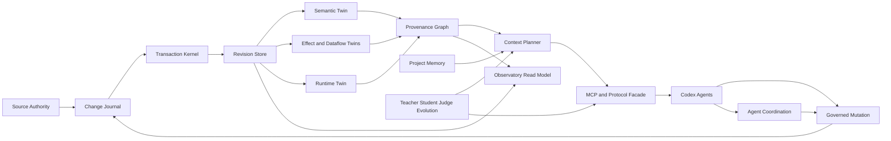

# Nolane Habitat Production-Grade Evolution Design

## Status

- **Design date:** 2026-08-23
- **Builds on:** `docs/superpowers/specs/2026-08-23-habitat-hardening-audit.md`
- **Baseline plan:** `docs/superpowers/plans/2026-08-23-habitat-comprehensive-hardening.md`
- **Target:** evolve Habitat from a strong local research prototype into a trustworthy AI-native project operating substrate without weakening its authority, provenance, or safety boundaries.

## Product north star

Habitat should let an agent enter an unfamiliar repository and rapidly construct a revision-bound, evidence-backed working model; make governed changes; prove what changed; preserve useful project memory; coordinate safely with other agents; and expose all observable work through Codex and the read-only Observatory.

The product is successful when it improves an agent's verified task performance, not when it merely stores more graph nodes, returns larger context, or advertises more tools.

## Design principles

1. **Truth before intelligence.** A smarter context planner is harmful if revision, migration, or transaction state can lie.
2. **Evidence before confidence.** Every semantic fact, memory, recommendation, and agent conclusion carries source, provider, revision, trust, and invalidation data.
3. **Sparse by default.** Habitat should page exact authority on demand and resist copying whole repositories into agent context.
4. **Compatibility at the edge.** Protocol, MCP, CLI, plugin, and snapshot contracts remain stable while internals are decomposed.
5. **Read-only observability.** Observatory can reveal bounded operational state but never becomes a mutation or hidden-reasoning control plane.
6. **Safe evolution.** Skills and ranking policies cannot approve themselves. Teacher, Student, and Judge identities remain separate.
7. **Measured power.** Semantic accuracy, context utility, task success, resource cost, recovery, and safety regressions are first-class release evidence.
8. **Local-first, provider-ready.** The current trusted-local authority remains excellent; remote providers are admitted only through capability contracts, not simulated by optimistic labels.

## Target architecture



### Layer contracts

| Layer | Owns | Must never own |
|---|---|---|
| Source Authority | canonical bytes, authoritative range reads, source capability report | semantic conclusions or implicit mutation permission |
| Change Journal | staged operations, filesystem-safe identifiers, recovery receipts | final revision truth before commit |
| Transaction Kernel | begin/savepoint/commit/rollback, writer ownership, migration atomicity | semantic ranking |
| Revision Store | coherent persisted state, schema migration, revision/Merkle identity | filesystem writes outside the journal |
| Twin Compilers | revision-bound derived facts and provider evidence | unsupported certainty or authority |
| Provenance Graph | fact lineage, trust, contradiction, invalidation | raw secrets or private chain-of-thought |
| Context Planner | budgeted selection, diversity, paging, feedback | changing repository state |
| Project Memory | durable facts/decisions/failures with lifecycle | immortal stale beliefs |
| Agent Coordination | leases, observations, notifications, conflict arbitration | bypassing transaction and authority checks |
| MCP/Protocol | stable compact public surface, validation, accounting | subsystem-specific business logic |
| Observatory | coherent read projections and operational diagnostics | mutation controls or hidden reasoning |
| Evolution System | frozen baselines, candidate policies, paired evaluation, admission evidence | circular self-approval |

## Capability tiers

### Tier 0 — Truthful core

- verified schema migrations and repair;
- atomic refresh/mutation/recovery;
- revision and Merkle invariants;
- read-only database doctor and recovery receipts;
- deterministic cross-platform test infrastructure.

### Tier 1 — Reliable cognition

- semantic benchmark corpus with exact expected facts;
- fact-level provenance and invalidation;
- calibrated trust and contradiction handling;
- context utility evaluation under fixed byte/token budgets;
- memory lifecycle and agent-private isolation.

### Tier 2 — Coordinated agency

- deterministic lease and conflict semantics;
- multi-agent observation and notification correctness;
- governed write plans with dry-run, precondition, receipt, and rollback;
- repeatable MCP/Codex lifecycle and skill-guided workflows.

### Tier 3 — Operational excellence

- platform/scale SLOs;
- failure injection and long-lived soak tests;
- privacy/export/retention controls;
- supply-chain manifests and reproducible release evidence;
- Observatory accessibility, latency, and reconnect guarantees.

### Tier 4 — Safe recursive improvement

- immutable Teacher baseline;
- isolated Student candidate;
- deterministic external Judge contract;
- paired control/candidate trials and ablations;
- protected safety, authorization, epistemic, integrity, and recovery dimensions;
- admission only for measured gains tied to observed baseline failures.

## Quantitative quality contract

These thresholds are release gates for the deterministic Habitat benchmark corpus. They are bounded claims, not universal performance promises.

| Dimension | Required threshold |
|---|---:|
| Parsed symbol precision | at least 97% |
| Parsed symbol recall | at least 95% |
| Static relation precision | at least 95% |
| Static relation recall | at least 90% |
| Changed-path stale-fact invalidation | 100% |
| Revision coherence after injected failure | 100% |
| Legacy migration fixture success | 100% for declared supported fixtures |
| Context budget compliance | 100% |
| Exact-source provenance for emitted context pages | 100% |
| Cross-agent private-state isolation scenarios | 100% |
| MCP repeated connect/orient/close cycles | at least 100/100 |
| Observatory SSE resume scenarios | 100% within retained sequence window |
| Protected-dimension regression in skill evolution | 0 admitted regressions |
| Required release artifact hash coverage | 100% |

For task-level or ranking improvements, candidate performance must beat the frozen control on the declared primary metric, preserve every protected dimension, and include confidence intervals or paired outcome counts. Aggregate gains cannot hide a serious per-scenario loss.

## Semantic quality model

Each emitted semantic fact must contain:

- a stable object ID;
- canonical source path and range when source-grounded;
- provider identity and version;
- workspace revision and source digest;
- trust class and parse completeness;
- derivation/evidence references;
- invalidation keys;
- contradiction or supersession links when applicable.

A semantic compiler can degrade explicitly when a provider is unavailable. It must not silently replace exact evidence with a higher-confidence heuristic label.

The benchmark corpus must contain ordinary, boundary, negative-space, malformed, generated, renamed, deleted, aliased, overloaded, minified, and multi-language examples. Training fixtures and sealed holdouts remain separate.

## Context intelligence model

The planner optimizes useful evidence per budget, not raw retrieval count. Evaluation covers:

- task relevance;
- authority bytes read;
- selected context bytes;
- symbol/relation diversity;
- duplication;
- exact-source page faults;
- stale or contradicted evidence;
- downstream verifier success;
- agent feedback utility;
- latency and cache behavior.

No adaptive ranking change is admitted solely because its own feedback table says it is better. It must pass paired task scenarios against a frozen baseline.

## Memory lifecycle

Project Memory records are not permanent beliefs. Every record has a status transition model:

```text
candidate -> active -> challenged -> superseded | invalidated | expired
```

Activation requires provenance. Source/revision changes trigger deterministic invalidation checks. Conflicting active memories produce an explicit contradiction, never last-write-wins truth. Agent-private memories and utility signals cannot influence another agent unless a deliberate shared-memory promotion records the authority and evidence.

## Multi-agent correctness

Agent coordination must satisfy:

- one active write lease per governed resource;
- bounded lease expiry and deterministic reacquisition;
- read-set validation at commit;
- no silent lost updates;
- explicit conflict and stale-observation receipts;
- idempotent notifications;
- agent-private state non-interference;
- deadlock detection or bounded timeout;
- deterministic cleanup after agent disconnect.

The system may recommend conflict resolution, but authority to overwrite or merge remains explicit.

## Security and privacy case

### Unacceptable losses

- mutation outside authorized roots;
- execution of untrusted code under a false sandbox claim;
- secret or private-agent-state exposure through logs, context, Observatory, exports, or release artifacts;
- database corruption or silent revision divergence;
- denial of service through unbounded indexing, context, browser capture, or retry loops;
- benchmark gaming that promotes a worse skill or ranking policy;
- remote binding or control-plane exposure without explicit configuration.

### Required controls

- canonical path containment and symlink/reparse-point tests;
- capability-based execution profile with truthful `sandboxed` and network/filesystem labels;
- loopback-only Observatory defaults and no mutation routes;
- secret-aware redaction before persistence and display;
- byte/time/count budgets at indexing, context, runtime ingestion, UI capture, and evolution runs;
- structured cleanup and rollback evidence;
- signed release manifest, dependency inventory, and artifact hashes;
- privacy export/forget verification across tables, caches, journals, backups, and artifacts.

Residual risk must remain visible. The trusted-local execution provider is not promoted as hostile-code isolation.

## Operational SLOs

SLOs are measured on declared fixtures and hardware profiles, with raw reports retained.

| Operation | Objective |
|---|---:|
| Warm unchanged refresh | compiles zero files and writes no new revision |
| One-file targeted refresh | considers requested paths plus declared semantic dependents only |
| Database recovery after injected crash | complete old or complete new state in 100% of cases |
| Workspace open/close soak | no increasing handle/process/connection trend over 100 cycles |
| MCP lifecycle soak | no orphan process or locked SQLite file over 100 cycles |
| Observatory snapshot | coherent single-revision projection in 100% of concurrent-write tests |
| Context compile | never exceeds requested byte budget |
| Release admission | always emits a report, including when blocked |

Absolute latency and memory budgets are stored per scale profile after a measured baseline. A candidate may not regress median latency or peak memory by more than 20% without an explicit accepted performance record.

## Observatory experience contract

Observatory must remain useful under degraded conditions:

- first meaningful state appears without waiting for every optional provider;
- SSE reconnect resumes from the last retained sequence or clearly requests a fresh snapshot;
- reduced-motion mode removes cinematic motion without removing information;
- keyboard navigation and focus state cover all interactive inspection surfaces;
- contrast, names, roles, and status announcements meet WCAG 2.2 AA for the audited screens;
- raw chain-of-thought, secrets, and agent-private memory never appear;
- large worlds use bounded level-of-detail rather than unbounded DOM growth.

## Safe skill and policy evolution

Every evolution run records:

1. Teacher version, lock hash, graph hash, runtime, model/tool configuration, and immutable baseline outputs.
2. Baseline failure IDs observed before the Student is changed.
3. Student changes linked to predicted outcomes.
4. Paired control/candidate runs in fresh comparable contexts.
5. Ablations, non-use controls, pressure cases, and collision/misuse cases.
6. Per-dimension wins, ties, losses, variance, and missing pairs.
7. A Judge verdict that cannot be authored solely from Student prose.
8. Admission rejection on any protected-dimension regression, stale lock, circular evidence, or evaluator gaming.

Two consecutive cycles that add no failure class or measurable information stop the evolution run.

## Release ladder

| Gate | Entry condition | Promotion evidence |
|---|---|---|
| Alpha hardening | audited alpha.18 baseline | P0 defect reproductions and repair tests |
| Alpha candidate | truth core green | Windows/Ubuntu matrix, migration fixtures, fault-injection report |
| Beta readiness | reliable cognition green | sealed semantic/context benchmarks and memory isolation |
| Beta candidate | coordinated agency green | multi-agent and MCP lifecycle soak, governed mutation receipts |
| Production candidate | operational excellence green | SLO, privacy, security, SBOM, reproducible release evidence |
| Skill/policy promotion | production baseline frozen | Teacher–Student–Judge paired admission with zero protected regressions |

No calendar date can override a failed gate.

## Workstream decomposition

1. **Truth Core:** Tasks 1–5 of `2026-08-23-habitat-comprehensive-hardening.md`.
2. **Architecture Hardening:** Tasks 6–9 of the same plan.
3. **Continuous Admission:** Tasks 10–12 of the same plan.
4. **Intelligence and Agent Evolution:** `2026-08-23-habitat-intelligence-and-agent-evolution.md`.
5. **Security, Scale, and Operations:** `2026-08-23-habitat-security-scale-and-operations.md`.

Truth Core blocks every other workstream that writes Habitat state. Read-only benchmark fixture construction and CI scaffolding may proceed in parallel, but their results cannot admit a release until Truth Core is green.

## Explicit non-goals

- claiming complete causal understanding from static relations;
- exposing private chain-of-thought;
- treating the local execution profile as a hostile-code sandbox;
- adding dozens of MCP tools when the compact adapter can route stable capabilities;
- using more retrieved context as a proxy for better agent performance;
- allowing a candidate skill, model, or ranking policy to judge its own promotion;
- rewriting the whole repository before characterization and fault tests exist.

## Program completion

The evolution program is complete only when all three implementation plans pass from clean checkouts, every release threshold has raw evidence, no P0/P1 risk remains unresolved, protected dimensions show no admitted regression, current documentation matches executable behavior, and residual risks are preserved in the release admission report.
